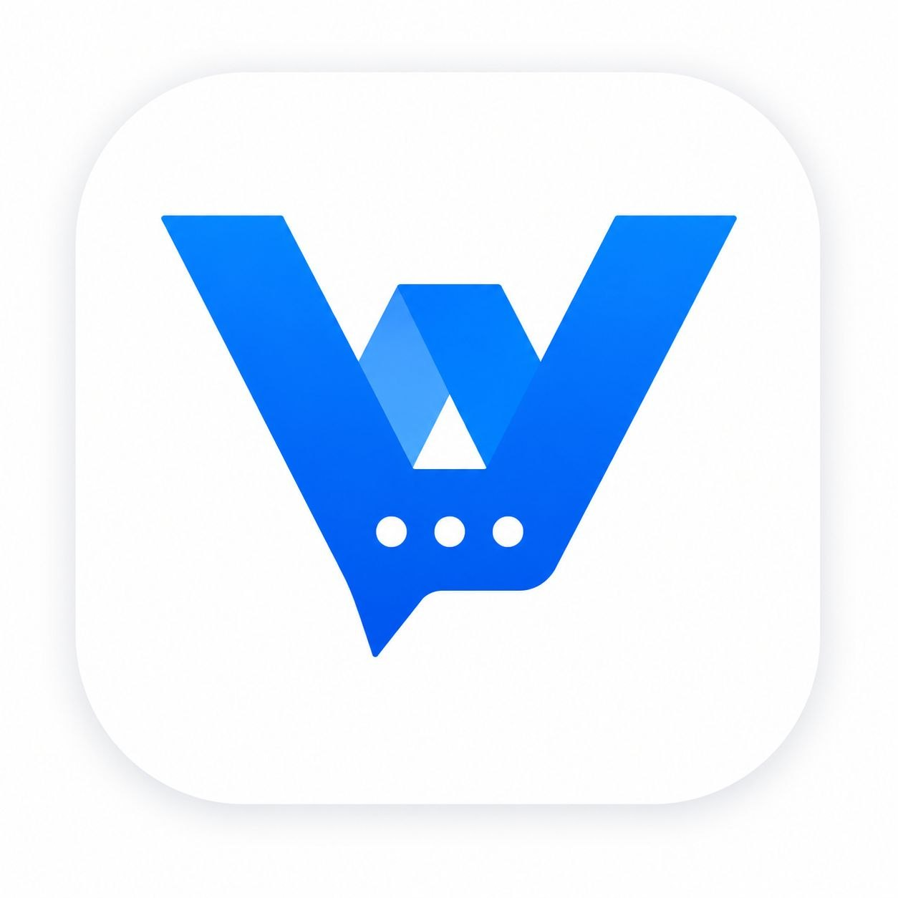
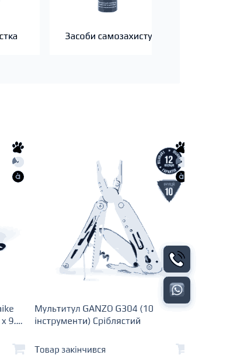

# Widget Platform

<p align="center">
  
</p>

**Widget Platform** — self-hosted платформа для керування контактними та промо-віджетами на сайтах.

Вона потрібна, коли ти хочеш не залежати від SaaS-конструкторів, а мати власну систему, де можна централізовано керувати віджетами для кількох сайтів, контролювати дизайн, сценарії показу, аналітику та доступи команди.

Платформа підходить для:
- digital-команд і дизайнерів, які ведуть кілька сайтів
- магазинів та сервісних бізнесів, яким потрібні контактні кнопки, банери, callback-форми
- self-hosted інфраструктури, де важливий контроль над даними, брендом і логікою показу
- команд, які хочуть мати owner/editor модель доступів без передачі всього керування підрядникам

## Що це дає

Замість розрізнених скриптів, сторонніх віджетів і ручного копіювання налаштувань між сайтами ти отримуєш одну панель, де можна:
- створювати сайти і підключати до них embed script
- збирати віджети різних типів в одному місці
- налаштовувати дизайн, позицію, анімації та поведінку показу
- давати редакторам доступ тільки до потрібних сайтів
- відслідковувати події та взаємодію користувачів
- розгортати все на власному сервері

## Можливості

### Типи віджетів
- **FLOATING_MENU** — плаваюче меню з каналами зв'язку (multi-button, stack, carousel)
- **POPUP_CALLBACK** — popup форма зворотного дзвінка з налаштовуваними полями
- **POPUP_BANNER** — банер з зображенням та CTA
- **STICKY_BAR** — приклеєна панель (зверху/знизу) з відступами та масштабом шрифту
- **SIDE_TAB** — бокова кнопка-вкладка

### FLOATING_MENU — деталі



- **Multi-button режим** — кілька кнопок (toggle/menu/direct)
- **Per-button налаштування** — розмір (px), масштаб іконки (%), колір фону, прозорість
- **Per-channel налаштування** — кожен канал має власний розмір, масштаб, колір
- **Карусель іконок** — автоматична зміна іконок на кнопці
- **Анімації привернення уваги** — pulse, shake, wobble, spin, swing, bounce, tada (на рівні іконки або кнопки)
- **Пауза між циклами анімації** — через keyframes, не animation-delay
- **Відступи** — налаштовуваний gap між кнопками та між каналами
- **Кастомні іконки** — завантаження власних PNG/SVG через Media Library
- **Z-index** — налаштовуваний шар кожного віджета
- **Форма зворотного зв'язку** — виклик зовнішнього POPUP_CALLBACK віджету по кнопці

### POPUP_CALLBACK — деталі
- **Режим виклику** — авто (тригери) або по кнопці з FLOATING_MENU
- **Налаштовувані поля форми** — телефон, текст, ім'я, email, випадаючий список
- **Мапінг полів у вебхук** — кожне поле має ключ для вебхука (напр. `customer_name`)
- **Маска телефону** — пресет країн (Україна +380, Польща +48, Вірменія +374, Грузія +995, Білорусь +375)
- **IMask** — динамічне завантаження, маска телефону
- **Робочий час** — графік по днях з інтервалами
- **Плейсхолдер {nextWorkDay}** — автоматично показує "завтра" або назву дня тижня
- **Тексти** — окремо для робочого/поза робочого часу (заголовок + кнопка)
- **Вебхук** — відправка даних форми у n8n або інший endpoint
- **Поведінка після відправки** — текст успіху/помилки, авто-закриття з затримкою
- **Дизайн попапа** — колір кнопки, фону, тексту, ширина, радіус бордюра

### Канали зв'язку
📞 Телефон | ✈️ Telegram | 💜 Viber | 💚 WhatsApp | 📧 Email | 📸 Instagram | 👤 Facebook | 🎵 TikTok | 💬 Chatwoot (inline) | 📲 Callback

- **Повні URL** — якщо value починається з протоколу (`https://`, `viber://`, `tg://`), відкривається як є
- **Chatwoot inline** — завантаження SDK при кліку, відкривається в поточному вікні (не в новій вкладці)

### Тригери показу
- ⏱️ Затримка N секунд
- 📜 Скрол до X%
- 🚪 Exit-intent (покидання сайту) з cooldown
- 😴 Idle (бездіяльність N сек)
- 🔄 Частота: once / every / days

### Анімації
**Входу:** `fade` | `slide-up` | `slide-down` | `slide-left` | `slide-right` | `zoom` | `bounce` | `elastic` | `flip`

**Привернення уваги:** `pulse` | `shake` | `wobble` | `spin` | `swing` | `bounce` | `tada`

### Планування
- 📅 Діапазон дат
- 📆 Дні тижня
- ⏰ Часові інтервали
- ❌ Виключені дати

### A/B Тестування
- Створення експериментів з варіантами
- Weighted traffic allocation
- Автоматична статистика
- Winner selection

### Доступність
- ♿ ARIA labels та roles
- ⌨️ Keyboard navigation
- 🔍 Screen reader support
- 🎚️ Reduced motion support
- 🔲 High contrast mode

### Продуктивність
- **Async embed** — `<script async>` не блокує рендер сторінки
- **Кеш 7 днів** — `Cache-Control: public, max-age=604800, immutable`
- **Версіонування** — `w.js?site=SLUG&v=1.0.0` для скидання кешу
- **Ліниве завантаження** — IMask завантажується лише коли відкривається форма

## Стек

| Компонент | Технологія |
|-----------|-----------|
| API | Node.js 20 + Fastify + Prisma ORM |
| БД | PostgreSQL 16 |
| Адмінка | React 18 + Tailwind + Recharts |
| Віджет | Vanilla JS (IIFE), ~72kb |
| Деплой | Docker Compose + Nginx |

## Архітектура

```
Браузер → Nginx → [API (Fastify) → PostgreSQL]
                  → [Admin SPA (React)]
                  → [w.js (static)]
                  → [Media files]
```

- **Nginx** — роутинг, gzip, rate limiting, security headers, static files
- **API** — Fastify, JWT auth, Prisma ORM, media uploads
- **Admin** — React SPA, build через Vite
- **Widget** — Vanilla JS IIFE, стилі інжектуються в runtime

## Швидкий старт

```bash
# Клонувати
git clone https://github.com/romboman19/widget-platform.git
cd widget-platform

# Налаштувати
cp .env.example .env
# Редагувати .env (DB_PASSWORD, JWT_SECRET, PUBLIC_URL, WIDGET_VERSION)

# Запустити
docker compose up -d --build
```

Адмінка: `http://localhost:8090`

Embed код:
```html
<script src="https://widgets.yourdomain.ua/w.js?site=your-site-slug&v=1.0.0" async></script>
```

## API Endpoints

### Публічні
| Method | Path | Опис |
|--------|------|------|
| GET | `/api/widget/:slug` | Конфіг + experiments |
| POST | `/api/analytics/track` | Трекінг показів/кліків |
| POST | `/api/analytics/form` | Форма → n8n webhook |
| GET | `/w.js` | Widget JS (кеш 7 днів) |

### Захищені (JWT)
| Method | Path | Опис |
|--------|------|------|
| POST | `/api/auth/login` | Логін |
| GET/POST | `/api/sites` | Список сайтів |
| GET/POST/PUT/DELETE | `/api/sites/:id/widgets/:wid` | Керування віджетами |
| GET/POST | `/api/sites/:id/experiments` | A/B тести |
| POST | `/api/sites/:id/experiments/:eid/start` | Старт тесту |
| POST | `/api/sites/:id/experiments/:eid/complete` | Завершити |
| GET/POST | `/api/media` | Завантаження медіа |

## Конфігурація

### Floating Menu (v2 — buttons)
```json
{
  "color": "#29574c",
  "layout": "vertical",
  "buttonGap": 7,
  "channelGap": 7,
  "buttonShape": { "type": "square", "borderRadius": 8 },
  "buttons": [
    {
      "id": "default",
      "mode": "toggle",
      "style": { "sizePx": 46, "bgColor": "#29574c", "iconScale": 60 },
      "channels": [
        {
          "type": "callback",
          "callbackWidgetId": "widget-id-here",
          "iconId": "media-id",
          "bgColor": "#29574c"
        }
      ]
    },
    {
      "id": "btn_menu",
      "mode": "menu",
      "channels": [
        { "type": "telegram", "value": "https://t.me/MyBot", "iconId": "...", "sizePx": 40, "iconScale": 100, "bgTransparent": true },
        { "type": "viber", "value": "viber://pa?chatURI=myaccount", "iconId": "..." },
        { "type": "chatwoot", "value": "https://chat.example.com/widget?website_token=xxx", "iconId": "..." }
      ]
    }
  ]
}
```

### POPUP_CALLBACK
```json
{
  "color": "#29574c",
  "popupBgColor": "#f4f4f4",
  "popupTextColor": "#0a0a0a",
  "popupWidth": 300,
  "popupRadius": 6,
  "fields": [
    { "id": "phone", "type": "phone", "label": "Телефон", "required": true, "mappedTo": "phone", "phoneMask": "+380" },
    { "id": "name", "type": "name", "label": "Ім'я", "required": false, "mappedTo": "customer_name" }
  ],
  "useWorkingHours": true,
  "workSchedule": {
    "mon": { "enabled": true, "from": "09:30", "to": "18:00" },
    "sat": { "enabled": true, "from": "09:30", "to": "17:00" }
  },
  "callbackTitle": "Ми на звʼязку. Зателефонувати Вам?",
  "callbackTitleOffHours": "Зараз неробочий час. Зателефонуємо Вам {nextWorkDay} о:",
  "callbackButton": "Передзвоніть мені зараз",
  "callbackButtonOffHours": "Чекаю на дзвінок",
  "webhookUrl": "https://n8n.example.com/webhook/callback",
  "successMessage": "Запит прийнято. Очікуйте дзвінка.",
  "autoClose": true,
  "autoCloseDelay": 3,
  "animation": "zoom"
}
```

### STICKY_BAR
```json
{
  "text": "Важливе повідомлення!",
  "bgColor": "#fec2c2",
  "textColor": "#333333",
  "color": "#29574c",
  "buttonText": "Детальніше",
  "buttonUrl": "/link",
  "sideOffset": 5,
  "bottomOffset": 5,
  "fontScale": 100,
  "design": { "fontFamily": "Arial", "fontSize": null, "borderRadius": 9 }
}
```

### Triggers
```json
{
  "delay": 5,
  "scrollPercent": 50,
  "exitIntent": true,
  "exitCooldown": 60,
  "idleTimeout": 30,
  "frequency": "once",
  "frequencyDays": 7,
  "triggerMode": "auto"
}
```

### Widget metadata
```json
{
  "id": "widget-id",
  "type": "FLOATING_MENU",
  "priority": 1,
  "zIndex": 999990,
  "enabled": true
}
```

## Команди

```bash
# Логи
docker compose logs -f api

# Оновлення
git pull origin main && docker compose up -d --build --force-recreate

# Зкинути кеш віджетів (після оновлення w.js)
# 1. Змінити WIDGET_VERSION в .env: WIDGET_VERSION=1.0.1
# 2. Перезапустити: docker compose up -d

# Бекап БД
docker compose exec postgres pg_dump -U widget widget_platform > backup.sql

# Відновлення БД
cat backup.sql | docker compose exec -T postgres psql -U widget widget_platform
```

## Змінні середовища

| Змінна | Опис | Default |
|--------|------|---------|
| `DB_PASSWORD` | Пароль PostgreSQL | `changeme` |
| `JWT_SECRET` | Секрет JWT | `change-this-secret` |
| `ADMIN_EMAIL` | Email адміна | `admin@yourdomain.ua` |
| `ADMIN_PASSWORD` | Пароль адміна | `changeme` |
| `PUBLIC_URL` | URL сервісу | `http://localhost:8090` |
| `WIDGET_VERSION` | Версія w.js (для кешу) | `1.0.0` |
| `HTTP_PORT` | Порт Nginx | `8090` |
| `NODE_ENV` | Режим | `production` |

## Історія версій

### v1.1.0
- ✅ FLOATING_MENU v2: multi-button, per-button/per-channel дизайн
- ✅ Карусель іконок на кнопці
- ✅ Per-button анімації привернення уваги (icon-level + button-level)
- ✅ POPUP_CALLBACK: повний перепис — поля форми, маски, робочий час, вебхук
- ✅ Плейсхолдер {nextWorkDay} для неробочого часу
- ✅ Chatwoot inline (SDK завантаження при кліку)
- ✅ Повні URL в каналах (viber://, https://t.me/)
- ✅ Z-index налаштовуваний для кожного віджета
- ✅ Відступи для Sticky Bar (side/bottom offset, font scale)
- ✅ Gap між кнопками та каналами
- ✅ Async embed + версіонування + кеш 7 днів immutable
- ✅ ConfigNormalizer fix (admin + api) — callbackWidgetId, per-channel поля
- ✅ Media Library + Templates Gallery

### v1.0.0
- ✅ Drag & Drop Builder
- ✅ Live Preview
- ✅ Embed script прив'язка
- ✅ Templates system
- ✅ Exit-intent + Idle triggers
- ✅ 10+ анімацій
- ✅ Scheduling
- ✅ FontAwesome icons
- ✅ A/B Testing
- ✅ Accessibility — ARIA, keyboard

## Внесок

Pull requests вітаються! Переконайтесь що зміни відповідають AGPLv3.

## Контакти

- GitHub: [romboman19/widget-platform](https://github.com/romboman19/widget-platform)